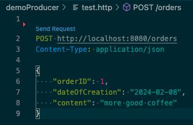
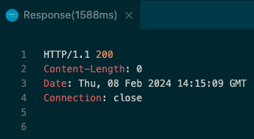
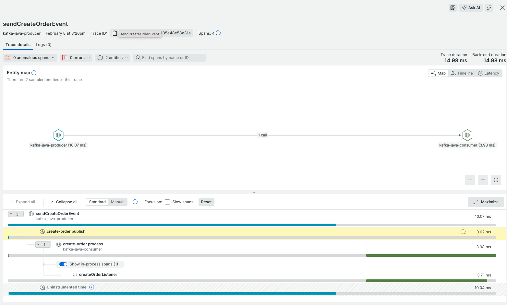

# Java Kafka producer and consumer demo application

This demo application contains a Kafka producer and consumer service. These applications are intended to run on a local development machine and are not designed to be deployed to some other environment.

Both services are configured to gather traces, metrics and logs by leveraging OpenTelemetry SDKs. Tracing is configured to connect the producer and consumer as one single distributed trace.

## Local deployment

### Kafka

You can use [this guide](https://www.conduktor.io/kafka/how-to-start-kafka-using-docker/) to create a local Kafka instance using Docker Desktop and a Docker compose configuration. In my case, I used the ```zk-single-kafka-single.yml``` configuration to launch a Kafka cluster with a single Zookeeper and a single broker.

```shell
docker-compose -f zk-single-kafka-single.yml up -d
```

### New Relic telemetry backend

I use New Relic as the telemetry backend for my OpenTelemetry instrumentation. If you already have a New Relic account, you can make sure to have your [New Relic license key](https://docs.newrelic.com/docs/apis/intro-apis/new-relic-api-keys/#overview-keys) ready for the configuration of the applications.

In case you do not have a New Relic account yet, follow these steps to get started:

1. [Sign up for New Relic](https://www.newrelic.com/signup?ref=kimpel.com)
2. From your New Relic account, retrieve your [original license key](https://docs.newrelic.com/docs/apis/intro-apis/new-relic-api-keys/#overview-keys)

### Configuration and build

Please follow the steps below to configure the applications.

1. Enter your New Relic license key into [application.properties](./demoProducer/src/main/resources/application.properties) file for the demoProducer service

2. **Please note**: The OTLP endpoint configuration in ```application.properties``` defaults to New Relic's US endpoint. This is correct, if you have set-up your account in US region. In case you created your New Relic account in EU region, please use the appropriate endpoint for EU.

3. Build the demoProducer

```shell
mvn clean install -DskipTests
```

4. Enter your New Relic license key into [application.properties](./demoConsumer/src/main/resources/application.properties) file for the demoConsumer service

5. **Please note**: The OTLP endpoint configuration in ```application.properties``` defaults to New Relic's US endpoint. This is correct, if you have set-up your account in US region. In case you created your New Relic account in EU region, please use the appropriate endpoint for EU.

6. Build the demoConsumer

```shell
mvn clean install -DskipTests
```

### Start the applications

1. Start the demoProducer application by executing the [run.sh](./demoProducer/run.sh) script.

The demo producer applicaton is ready when you see similar output like this:

```shell
2024-02-08T15:06:22.797+01:00  INFO 21106 --- [           main] o.s.b.w.embedded.tomcat.TomcatWebServer  : Tomcat initialized with port 8080 (http)
2024-02-08T15:06:22.814+01:00  INFO 21106 --- [           main] o.apache.catalina.core.StandardService   : Starting service [Tomcat]
2024-02-08T15:06:22.815+01:00  INFO 21106 --- [           main] o.apache.catalina.core.StandardEngine    : Starting Servlet engine: [Apache Tomcat/10.1.18]
2024-02-08T15:06:22.925+01:00  INFO 21106 --- [           main] o.a.c.c.C.[Tomcat].[localhost].[/]       : Initializing Spring embedded WebApplicationContext
2024-02-08T15:06:22.926+01:00  INFO 21106 --- [           main] w.s.c.ServletWebServerApplicationContext : Root WebApplicationContext: initialization completed in 1166 ms
2024-02-08T15:06:23.815+01:00  INFO 21106 --- [           main] o.s.b.w.embedded.tomcat.TomcatWebServer  : Tomcat started on port 8080 (http) with context path ''
2024-02-08T15:06:23.823+01:00  INFO 21106 --- [           main] c.e.d.DemoProducerApplication            : Started DemoProducerApplication in 2.502 seconds (process running for 2.949)
```

Once you see the above information, you can test whether your applications works as expected by executing the following script:

```shell
curl http://localhost:8080
```

As a result, you should see this message:

```shell
Greetings from Spring Boot producer!
```

2. Start the demoConsumer application by executing the [run.sh](./demoConsumer/run.sh) script.

The demo consumer applicaton is ready when you see similar output like this:

```shell
2024-02-08T15:07:40.548+01:00  INFO 21890 --- [           main] o.a.kafka.common.utils.AppInfoParser     : Kafka version: 3.6.1
2024-02-08T15:07:40.550+01:00  INFO 21890 --- [           main] o.a.kafka.common.utils.AppInfoParser     : Kafka commitId: 000000000000
2024-02-08T15:07:40.550+01:00  INFO 21890 --- [           main] o.a.kafka.common.utils.AppInfoParser     : Kafka startTimeMs: 1707401260547
2024-02-08T15:07:40.553+01:00  INFO 21890 --- [           main] fkaConsumerFactory$ExtendedKafkaConsumer : [Consumer clientId=000000000000000000000, groupId=notification] Subscribed to topic(s): create-order
2024-02-08T15:07:40.570+01:00  INFO 21890 --- [           main] c.e.d.DemoConsumerApplication            : Started DemoConsumerApplication in 2.918 seconds (process running for 3.322)
2024-02-08T15:07:41.036+01:00  INFO 21890 --- [ntainer#0-0-C-1] org.apache.kafka.clients.Metadata        : [Consumer clientId=000000000000000000000, groupId=notification] Cluster ID: 
2024-02-08T15:07:41.081+01:00  INFO 21890 --- [ntainer#0-0-C-1] o.a.k.c.c.internals.ConsumerCoordinator  : [Consumer clientId=000000000000000000000, groupId=notification] Discovered group coordinator 127.0.0.1:9092 (id: 01234567890 rack: null)
2024-02-08T15:07:41.084+01:00  INFO 21890 --- [ntainer#0-0-C-1] o.a.k.c.c.internals.ConsumerCoordinator  : [Consumer clientId=000000000000000000000, groupId=notification] (Re-)joining group
2024-02-08T15:07:41.179+01:00  INFO 21890 --- [ntainer#0-0-C-1] o.a.k.c.c.internals.ConsumerCoordinator  : [Consumer clientId=000000000000000000000, groupId=notification] Request joining group due to: need to re-join with the given member-id: 00000000-0000-0000-0000-000000000000-0-00000000-0000-0000-0000-0000000000000
2024-02-08T15:07:41.180+01:00  INFO 21890 --- [ntainer#0-0-C-1] o.a.k.c.c.internals.ConsumerCoordinator  : [Consumer clientId=000000000000000000000, groupId=notification] Request joining group due to: rebalance failed due to 'The group member needs to have a valid member id before actually entering a consumer group.' (MemberIdRequiredException)
2024-02-08T15:07:41.180+01:00  INFO 21890 --- [ntainer#0-0-C-1] o.a.k.c.c.internals.ConsumerCoordinator  : [Consumer clientId=000000000000000000000, groupId=notification] (Re-)joining group
2024-02-08T15:07:44.229+01:00  INFO 21890 --- [ntainer#0-0-C-1] o.a.k.c.c.internals.ConsumerCoordinator  : [Consumer clientId=000000000000000000000, groupId=notification] Successfully joined group with generation Generation{generationId=39, memberId='00000000-0000-0000-0000-000000000000-0-00000000-0000-0000-0000-0000000000000', protocol='range'}
2024-02-08T15:07:44.237+01:00  INFO 21890 --- [ntainer#0-0-C-1] o.a.k.c.c.internals.ConsumerCoordinator  : [Consumer clientId=000000000000000000000, groupId=notification] Finished assignment for group at generation 39: {00000000-0000-0000-0000-000000000000-0-00000000-0000-0000-0000-0000000000000=Assignment(partitions=[create-order-0])}
2024-02-08T15:07:44.503+01:00  INFO 21890 --- [ntainer#0-0-C-1] o.a.k.c.c.internals.ConsumerCoordinator  : [Consumer clientId=000000000000000000000, groupId=notification] Successfully synced group in generation Generation{generationId=39, memberId='00000000-0000-0000-0000-000000000000-0-00000000-0000-0000-0000-0000000000000', protocol='range'}
2024-02-08T15:07:44.504+01:00  INFO 21890 --- [ntainer#0-0-C-1] o.a.k.c.c.internals.ConsumerCoordinator  : [Consumer clientId=000000000000000000000, groupId=notification] Notifying assignor about the new Assignment(partitions=[create-order-0])
2024-02-08T15:07:44.508+01:00  INFO 21890 --- [ntainer#0-0-C-1] o.a.k.c.c.internals.ConsumerCoordinator  : [Consumer clientId=000000000000000000000, groupId=notification] Adding newly assigned partitions: create-order-0
2024-02-08T15:07:44.552+01:00  INFO 21890 --- [ntainer#0-0-C-1] o.a.k.c.c.internals.ConsumerCoordinator  : [Consumer clientId=000000000000000000000, groupId=notification] Setting offset for partition create-order-0 to the committed offset FetchPosition{offset=134, offsetEpoch=Optional.empty, currentLeader=LeaderAndEpoch{leader=Optional[127.0.0.1:9092 (id: 1 rack: null)], epoch=0}}
2024-02-08T15:07:44.653+01:00  INFO 21890 --- [ntainer#0-0-C-1] o.s.k.l.KafkaMessageListenerContainer    : notification: partitions assigned: [create-order-0]
```

Once you see the above information, you can test whether your applications works as expected by executing the following script:

```shell
curl http://localhost:8081
```

As a result, you should see this message:

```shell
Greetings from Spring Boot consumer!
```

### Creating an order - demo producer

As part of the demoProducer I have provided a small test request for you to create an order on the producer service. I leverage a [Visual Studio REST client](https://marketplace.visualstudio.com/items?itemName=humao.rest-client) file called [test.http](./demoProducer/test.http).

Click on the ```Send request```link



... and after a while you should get a response like that



In the terminal output of the demoProducer service, you will get an output like that

```shell
2024-02-08T15:15:09.626+01:00  INFO 21106 --- [nio-8080-exec-1] c.e.demoProducer.CreateOrderProducer     : SendResult [producerRecord=ProducerRecord(topic=create-order, partition=null, headers=RecordHeaders(headers = [RecordHeader(key = traceparent, value = [48, 48, 45, 56, 48, 57, 56, 54, 49, 55, 48, 55, 48, 101, 54, 97, 97, 51, 48, 51, 49, 49, 97, 56, 57, 97, 57, 49, 50, 101, 50, 101, 57, 97, 57, 45, 54, 57, 102, 49, 51, 51, 55, 52, 57, 49, 99, 49, 53, 102, 48, 52, 45, 48, 49]), RecordHeader(key = __TypeId__, value = [99, 111, 109, 46, 101, 120, 97, 109, 112, 108, 101, 46, 100, 101, 109, 111, 80, 114, 111, 100, 117, 99, 101, 114, 46, 79, 114, 100, 101, 114])], isReadOnly = true), key=null, value=Order(orderID=1, dateOfCreation=Thu Feb 08 01:00:00 CET 2024, content=more good coffee), timestamp=null), recordMetadata=create-order-0@134]
```

### Receiving the order - demo consumer

In the demo consumer terminal output, you should see an output like this

```shell
2024-02-08T15:07:44.653+01:00  INFO 21890 --- [ntainer#0-0-C-1] o.s.k.l.KafkaMessageListenerContainer    : notification: partitions assigned: [create-order-0]
2024-02-08T15:15:10.606+01:00  INFO 21890 --- [ntainer#0-0-C-1] c.e.demoConsumer.CreateOrderConsumer     : Notification service received order Order(orderID=1, dateOfCreation=Thu Feb 08 01:00:00 CET 2024, content=more good coffee) 
```

This confirms that the producer has created a message in Kafka and the consumer has received the message as part of the subscriber on the topic.

## New Relic distributed tracing

After you started both applications and sent some test orders to the producer, you can visualize these traces in New Relic.



You can see how the trace is initiated in the ```sendCreateOrderEvent``` on the ```kafka-java-producer``` application. The next span shows the ```create-order publish``` section. The trace continues on the ```kafka-java-consumer``` application with the ```create-order process``` span, followed by the ```createOrderListener```method.
